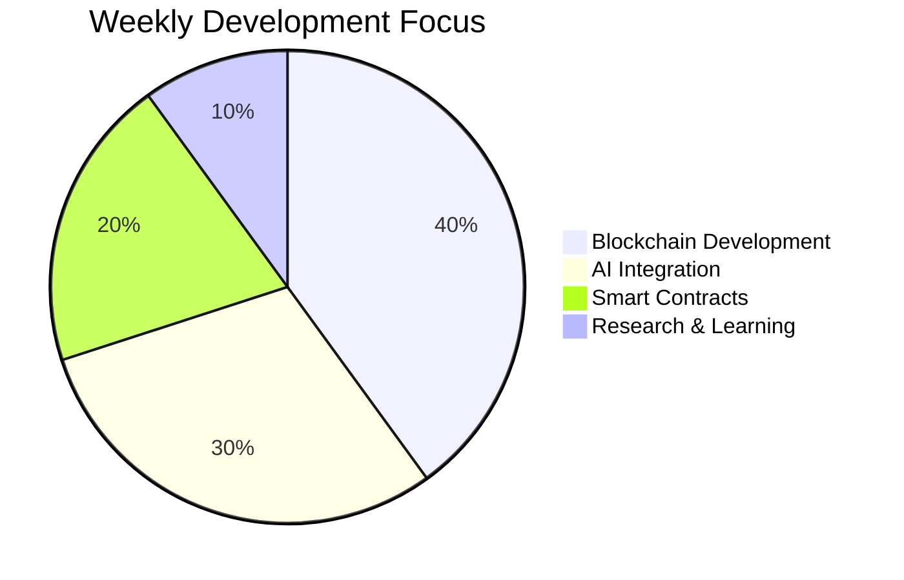

  

  

  

## 🚀 About Me

  

I'm a passionate **Blockchain Developer** with a vision to revolutionize the industry by integrating **Artificial Intelligence** and **Automation**. My goal is to create innovative solutions that bridge the gap between blockchain technology and AI, making a significant impact in the digital world.

## 🛠️ Tech Stack

  

### Blockchain Development
- Smart Contract Development (Solidity, Rust)
- DeFi Protocols
- NFT Development
- Web3 Integration
- Blockchain Architecture

### AI & Automation
- Machine Learning
- Neural Networks
- AI Agents Development
- Workflow Automation
- Natural Language Processing

## 🌟 Current Projects

  

- 🤖 Building AI-powered blockchain solutions
- 🔄 Developing automated smart contract workflows
- 🌐 Creating decentralized AI agents
- 🔗 Integrating AI with DeFi protocols

## 📈 GitHub Stats

  

## 🤝 Connect With Me

  
  
  

## 🌟 Featured Projects

  

### AI-Blockchain Integration
- Smart Contract Automation
- AI-Powered DeFi Solutions
- Decentralized AI Agents

## 📊 Weekly Development Breakdown

## 🎯 Goals

  

- [ ] Create revolutionary AI-Blockchain solutions
- [ ] Develop automated smart contract workflows
- [ ] Build decentralized AI agents
- [ ] Contribute to open-source blockchain projects
- [ ] Mentor aspiring blockchain developers

## 📫 How to Reach Me

  

- 📧 Email: your-email@example.com
- 💼 LinkedIn: [Your LinkedIn Profile]
- 🐦 Twitter: [@YourTwitterHandle]
- 🌐 Portfolio: [Your Portfolio Website]

---

  
   
  

 
